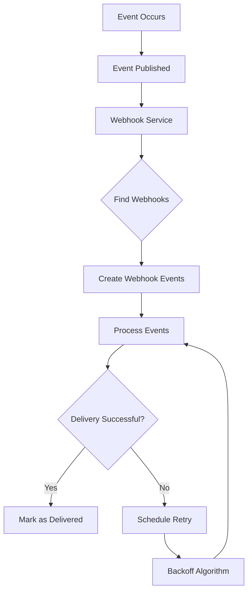

# LightSpeedPay Webhook System

## Overview

The webhook system enables merchants to receive real-time notifications about events that occur within the LightSpeedPay platform. This allows for immediate reactions to important events like transaction status changes, settlements, and more.

## Architecture



The webhook system follows these steps:

1. An event occurs in the system (e.g., transaction status change)
2. The event is published to the webhook service
3. The service finds all relevant webhooks that subscribe to this event type
4. For each webhook, it creates a webhook event record
5. It then attempts to deliver the event to the webhook endpoint
6. If successful, it marks the event as delivered
7. If failed, it schedules a retry with exponential backoff

## Key Components

### Webhook Service (`webhookService.ts`)

Core service that handles:
- Webhook registration and management
- Event delivery and retry logic
- Signature generation for security
- Tracking delivery status

### Webhook Processor (`webhook-processor.ts`)

Background job that:
- Processes pending webhook events
- Retries failed deliveries with exponential backoff
- Cleans up old webhook events

### Webhook Handlers (`webhook-handler.ts`)

API handlers for:
- Creating, reading, updating, and deleting webhooks
- Managing webhook configurations
- Securing webhook access

### Database Schema

Two main tables:
- `webhooks`: Stores webhook configurations
- `webhook_events`: Tracks event delivery status and history

## Event Types

The LightSpeedPay platform supports the following webhook event types:

| Event Type | Description |
|------------|-------------|
| `transaction.created` | A new transaction has been created |
| `transaction.updated` | A transaction's status has been updated |
| `transaction.completed` | A transaction has been completed successfully |
| `transaction.failed` | A transaction has failed |
| `settlement.created` | A new settlement has been created |
| `settlement.completed` | A settlement has been completed |

## Security

Webhooks are secured using HMAC signatures:

1. Each webhook has a unique secret key
2. When a webhook is delivered, the payload is signed using HMAC-SHA256
3. The signature is included in the `X-Lightspeed-Signature` header
4. Merchants should verify this signature to ensure the webhook is authentic

Example verification code (Node.js):

```javascript
const crypto = require('crypto');

function verifyWebhookSignature(payload, signature, secret) {
  const computedSignature = crypto
    .createHmac('sha256', secret)
    .update(JSON.stringify(payload))
    .digest('hex');
  
  return crypto.timingSafeEqual(
    Buffer.from(signature),
    Buffer.from(computedSignature)
  );
}
```

## Webhook Delivery

### Request Format

```
POST https://your-endpoint.com/webhook
Content-Type: application/json
X-Lightspeed-Signature: <hmac_signature>
X-Lightspeed-Event: transaction.completed
```

### Payload Format

```json
{
  "id": "evt_123456789",
  "event_type": "transaction.completed",
  "created_at": "2023-11-20T14:30:00Z",
  "payload": {
    "transaction_id": "txn_987654321",
    "merchant_id": "mer_123456789",
    "amount": 1000,
    "currency": "INR",
    "status": "completed",
    "gateway": "razorpay",
    "customer_email": "customer@example.com",
    "metadata": {}
  }
}
```

## Best Practices

1. **Respond quickly**: Your webhook endpoint should acknowledge receipt (HTTP 200) as quickly as possible, then process the webhook asynchronously.

2. **Implement idempotency**: Design your webhook handler to be idempotent, as the same event may be delivered multiple times.

3. **Verify signatures**: Always verify the webhook signature to ensure it's coming from LightSpeedPay.

4. **Handle failures gracefully**: If your endpoint is temporarily unavailable, LightSpeedPay will retry with exponential backoff.

5. **Monitor webhook deliveries**: Use the dashboard to monitor webhook deliveries and troubleshoot issues.

## Frontend Integration

The merchant dashboard includes a dedicated webhooks page that allows merchants to:

1. View all registered webhooks
2. Create new webhooks
3. Edit existing webhooks
4. Delete webhooks
5. View webhook secrets (for verification)

## Implementation Notes

- All webhook events are guaranteed to be delivered at least once, but may be delivered more than once
- Failed deliveries are retried with exponential backoff for up to 5 attempts
- Successful webhook events are stored for 7 days, while failed events are stored for 30 days
- Webhook URLs must use HTTPS for security 